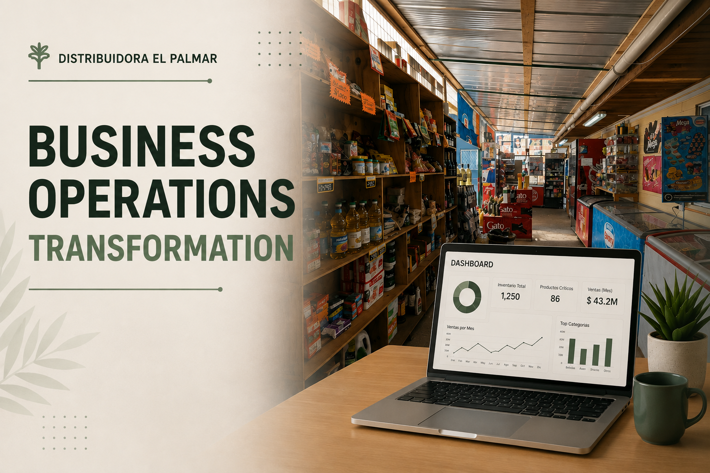

<p align="center">
  
</p>

# Business Operations Transformation — Distribuidora El Palmar

## 📌 Project Overview

Business operations and data transformation project for Distribuidora El Palmar, focused on improving inventory management, operational processes, ERP data utilization, business reporting, and data-driven decision support.

The project started with an operational analysis of inventory and warehouse processes and evolved into a broader Business Intelligence initiative integrating ERP data, SQL, Excel, and Power BI.

The objective is to transform operational data into actionable information that can support sales growth, inventory optimization, profitability analysis, and purchasing decisions.

---

## 🎯 Business Objectives

- Improve inventory accuracy and visibility.
- Standardize product and inventory information.
- Improve warehouse organization and stock control.
- Increase the use of ERP-generated information.
- Analyze sales and product profitability.
- Identify stockouts, slow-moving products, and high-rotation products.
- Support purchasing decisions using historical sales and inventory data.
- Identify opportunities to increase sales and improve margins.
- Reduce manual reporting and data consolidation.
- Build an interactive Business Intelligence solution for management and decision support.

---

## 🔎 Business Analysis

### Key Areas Analyzed

- Inventory management
- Warehouse organization
- Sales performance
- Product classification
- Product profitability
- Purchasing processes
- Customer activity
- ERP utilization
- Operational reporting
- Data accessibility

### Key Challenges Identified

- Inconsistent product naming and classification.
- Limited visibility into real-time inventory information.
- Manual stock verification and reconciliation.
- Fragmented operational information.
- Underutilization of ERP data.
- Difficulty identifying slow-moving and critical-stock products.
- Limited analytical support for purchasing decisions.
- Manual reporting and data consolidation.

---

## 🏭 Inventory & Operations Transformation

A significant part of the project focused on improving inventory organization and operational control.

Key activities included:

- Product categorization and standardization.
- Warehouse zoning and organization.
- Inventory counting and reconciliation.
- Identification of critical stock.
- Analysis of inventory discrepancies.
- Review of ERP inventory capabilities.
- Evaluation of stock rotation and product availability.

These activities established a more structured foundation for the subsequent data analytics and Business Intelligence work.

---

## 🗄️ Data & ERP Integration

The project evolved from manually managed inventory information toward structured analysis using ERP data.

The existing ERP system, MrCloud, provides access to operational and transactional information through a MySQL database.

The database contains information related to:

- Products
- Product categories and families
- Inventory by warehouse
- Sales documents
- Sales details
- Purchases
- Suppliers
- Customers
- Prices
- Units of measure
- Inventory movements
- Returns
- Cash operations

SQL is being used to transform the ERP data into analytical datasets and reusable views before connecting the information to Power BI.

### Data Architecture

```text
MrCloud ERP
     ↓
MySQL Database
     ↓
SQL Queries / Views
     ↓
Power BI
     ↓
Business Intelligence Dashboard
     ↓
Decision Support
