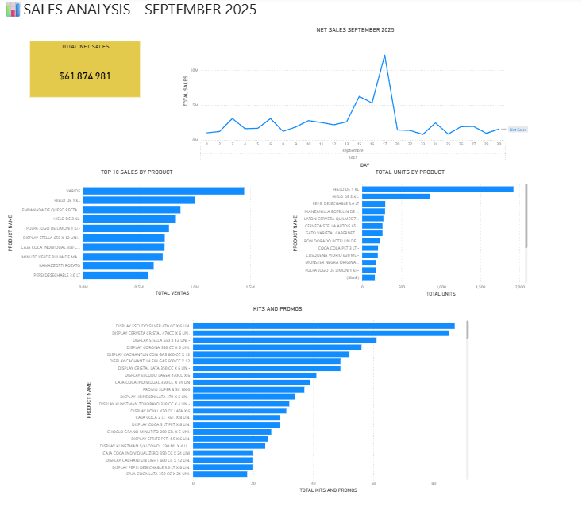

# Sales Analysis — September 2025

## Overview

Sales analysis developed in Power BI using transactional data from the ERP database.

The analysis focuses on sales performance during September 2025, with emphasis on products, daily sales trends, units sold, and overall sales performance.

## Key Analysis

- Total net sales
- Daily sales trend
- Top 10 products by sales
- Top products by units sold
- Sales by category
- Best-selling promotions and kits

## Tools

- MySQL
- Power BI
- DAX
- Excel

## Dashboard

